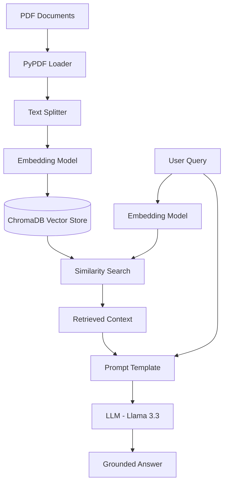

# LegalAssist AI


An AI-powered legal and banking assistant for India built on Retrieval Augmented Generation (RAG). Provides accurate, document-grounded answers to legal and banking queries without hallucination.

## Overview

LegalAssist AI is a specialized query system designed to provide contextually accurate information regarding Indian law and banking regulations. By employing Retrieval Augmented Generation (RAG), the system grounds its responses in verified source documents rather than relying solely on the pre-training data of a large language model. This approach minimizes hallucinations and provides users with factual, source-backed answers to complex legal and financial questions. The application addresses the critical need for reliable, domain-specific information retrieval in sectors where accuracy is paramount.

## Architecture

The system follows a standard RAG pipeline, separating document ingestion from query execution.



## Features

| Feature | Description | Status |
|---|---|---|
| Legal Assistant | Query SC judgments, IPC, CrPC, Constitution | Live |
| Banking Assistant | RBI guidelines, PMJDY, KYC, rural banking | Live |
| Document Chat | Upload any PDF and ask questions about it | Live |
| RAG vs AI Comparison | Side by side RAG vs base Llama answers | Live |

## Tech Stack

| Layer | Technology |
|---|---|
| LLM | Llama 3.3 70B via Groq API |
| RAG Framework | LangChain |
| Vector Database | ChromaDB |
| Embeddings | sentence-transformers/all-MiniLM-L6-v2 |
| Backend | FastAPI (Python 3.12) |
| Frontend | Next.js 15, Tailwind CSS |
| Document Processing | PyPDF |

## Knowledge Base

### Legal Knowledge Base

- 29 source documents
- 11,694 vectors indexed
- Covers: Supreme Court judgments, Constitution of India, IPC, CrPC, Indian Evidence Act, RTI Act, Domestic Violence Act
- Key cases: DK Basu, Vishaka, Maneka Gandhi, Kesavananda Bharati, Shreya Singhal, KS Puttaswamy, SR Bommai, Bachan Singh and 20+ more

### Banking Knowledge Base

- 11 source documents
- 1,403 vectors indexed
- Covers: PMJDY guidelines, RBI Banking Ombudsman Scheme, KYC guidelines, Fair Practices Code, Banking Regulation Act 1949

## Project Structure

```text
LegalAssist-AI/
├── data/                    # Legal PDF documents (29 files)
├── data_banking/            # Banking PDF documents (11 files)
├── notebooks/               # Jupyter notebooks for RAG 
│                              experimentation and testing
├── src/
│   ├── app.py               # FastAPI backend, all endpoints
│   ├── rag_chain.py         # Legal RAG chain
│   ├── ingest.py            # Legal document ingestion
│   └── ingest_banking.py    # Banking document ingestion
├── frontend/                # Next.js frontend application
├── chroma_db/               # Legal vector store (generated)
├── chroma_db_banking/       # Banking vector store (generated)
├── .env                     # Environment variables (not committed)
├── requirements.txt         # Python dependencies
└── README.md
```

## API Endpoints

| Method | Endpoint | Description |
|---|---|---|
| POST | /ask | Legal RAG query |
| POST | /ask-banking | Banking RAG query |
| POST | /ask-document | Query uploaded PDF |
| POST | /upload-document | Upload a PDF for chat |
| POST | /compare | RAG vs base Llama comparison |
| GET | /health | Health check |
| GET | /docs | Interactive API documentation |

## Setup

### Prerequisites

- Python 3.12
- Node.js 18+
- Groq API key (free at console.groq.com)

### Installation

1. Clone the repository
2. Create virtual environment: python -m venv venv
3. Activate on Windows: venv\Scripts\activate
4. Install Python dependencies: pip install -r requirements.txt
5. Create .env file and add: GROQ_API_KEY=your_key_here
6. Ingest legal documents: python src/ingest.py
7. Ingest banking documents: python src/ingest_banking.py
8. Start backend: cd src && uvicorn app:app --reload
9. In a new terminal start frontend: cd frontend && npm run dev
10. Open http://localhost:3000

## How RAG Works

During the ingestion phase, source PDF documents are processed, split into manageable text chunks, and converted into mathematical representations called embeddings. These embeddings are then stored in a specialized vector database, creating a searchable semantic index of the entire knowledge base. The chunking process utilizes the RecursiveCharacterTextSplitter to maintain paragraph cohesion while respecting token limits.

When a user submits a query, the system converts the question into an embedding using the identical sentence-transformer model. It then performs a cosine similarity search against the vector database to retrieve the text chunks most relevant to the user's question. This retrieval step ensures the subsequent generation phase is strictly limited to the factual boundaries of the retrieved data.

The retrieved text chunks are combined with the original query and injected into a strict prompt template. By providing the large language model with explicit, verified context, it generates an answer based strictly on the provided documents. This architecture prevents the model from relying on its internal pre-training data, thereby significantly reducing hallucinations and ensuring domain accuracy.

## Limitations

- Answers are limited to documents in the knowledge base
- Scanned PDFs without selectable text cannot be ingested
- Not a substitute for professional legal or financial advice
- Session-based document chat does not persist after server restart
- Banking knowledge base is currently limited to 11 documents

## Disclaimer

This project is for educational and informational purposes only. It does not constitute legal or financial advice. Always consult a qualified professional for legal matters or financial decisions.
