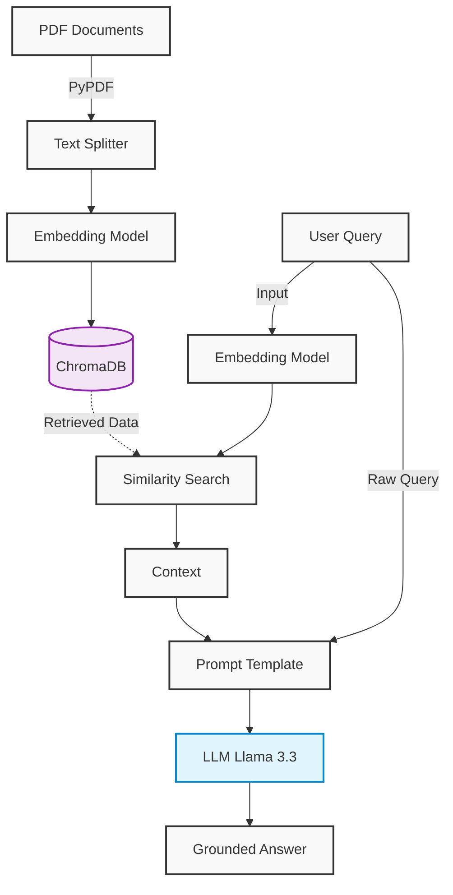

<div align="center">

# LegalAssist AI

**Your intelligent, document-grounded legal and banking assistant for India!**


[Features](#features) • [Tech Stack](#tech-stack) • [Knowledge Base](#knowledge-base) • [Setup](#setup)

</div>

---

## Overview

Welcome to **LegalAssist AI**! Navigating Indian law and banking regulations can be overwhelming, but it doesn't have to be. We built this specialized query system to provide you with **contextually accurate, highly reliable** information. 

By leveraging **Retrieval Augmented Generation (RAG)**, LegalAssist AI grounds its responses in verified source documents rather than guessing or relying on outdated LLM memory. This means **zero hallucinations** and 100% factual, source-backed answers to your complex legal and financial questions.

---

## Architecture Workflow

Here's a behind-the-scenes look at how the system operates:



---

## Features

What can LegalAssist AI do for you? Let's take a look:

| Feature | Description | Status |
| :--- | :--- | :---: |
| **Legal Assistant** | Query SC judgments, IPC, CrPC, and the Constitution with ease. | Live |
| **Banking Assistant**| Decode RBI guidelines, PMJDY, KYC, and rural banking policies. | Live |
| **Document Chat** | Upload *any* PDF document and chat with it instantly! | Live |
| **RAG vs Base AI** | See the difference! Side-by-side comparison of RAG vs standard LLM. | Live |

---

## Tech Stack

We used the best tools in the ecosystem to build this application:

- **LLM:** Llama 3.3 70B *(via Groq API for blazing fast inference)*
- **RAG Framework:** LangChain
- **Vector Database:** ChromaDB
- **Embeddings:** `sentence-transformers/all-MiniLM-L6-v2`
- **Backend:** FastAPI (Python 3.12)
- **Frontend:** Next.js 15 & Tailwind CSS
- **Parsing:** PyPDF

---

## The Knowledge Base

Our system is packed with verified, high-quality data.

### Legal Knowledge Base
> **29 Source Documents | 11,694 Vectors Indexed**
- **Covers:** Supreme Court judgments, Constitution of India, IPC, CrPC, Indian Evidence Act, RTI Act, Domestic Violence Act.
- **Key Cases Included:** *DK Basu, Vishaka, Maneka Gandhi, Kesavananda Bharati, Shreya Singhal, KS Puttaswamy, SR Bommai, Bachan Singh,* and 20+ more!

### Banking Knowledge Base
> **11 Source Documents | 1,403 Vectors Indexed**
- **Covers:** PMJDY guidelines, RBI Banking Ombudsman Scheme, KYC guidelines, Fair Practices Code, and the Banking Regulation Act 1949.

---

## Project Structure

```text
LegalAssist-AI/
├── data/                    # Legal PDFs (29 files)
├── data_banking/            # Banking PDFs (11 files)
├── notebooks/               # Jupyter notebooks for testing
├── src/                     # Python Backend
│   ├── app.py               # FastAPI backend & endpoints
│   ├── rag_chain.py         # Legal RAG chain logic
│   ├── ingest.py            # Legal document ingestion
│   └── ingest_banking.py    # Banking document ingestion
├── frontend/                # Next.js Application
├── chroma_db/               # Legal vector store 
├── chroma_db_banking/       # Banking vector store
├── .env                     # Secrets (Not committed)
├── requirements.txt         # Dependencies
└── README.md
```

---

## API Endpoints

Our FastAPI backend provides several clean, easy-to-use endpoints:

| Method | Endpoint | What it does |
|:---:|:---|:---|
| `POST` | `/ask` | Queries the **Legal** RAG chain |
| `POST` | `/ask-banking` | Queries the **Banking** RAG chain |
| `POST` | `/upload-document`| Uploads a PDF and creates a session |
| `POST` | `/ask-document` | Chats with your uploaded PDF |
| `POST` | `/compare` | Side-by-side RAG vs Base Llama output |
| `GET`  | `/health` | Server health check |
| `GET`  | `/docs` | Interactive Swagger API documentation |

---

## Setup & Installation

Ready to run this locally? Follow these simple steps.

### Prerequisites
- **Python 3.12+**
- **Node.js 18+**
- **Groq API Key** (Get it free at [console.groq.com](https://console.groq.com))

### Quick Start Guide

**1. Clone the repo**
```bash
git clone https://github.com/Roshann78/Legal-Assist-Chatbot.git
cd Legal-Assist-Chatbot
```

**2. Setup Python Environment**
```bash
python -m venv venv
venv\Scripts\activate   # On Windows
```

**3. Install Dependencies & Add Keys**
```bash
pip install -r requirements.txt
# Create a .env file in the root and add:
# GROQ_API_KEY=your_super_secret_key_here
```

**4. Ingest the Data**
```bash
python src/ingest.py           # Process legal docs
python src/ingest_banking.py   # Process banking docs
```

**5. Fire up the Backend!**
```bash
cd src
uvicorn app:app --reload
```

**6. Launch the Frontend!**
```bash
# Open a new terminal window
cd frontend
npm run dev
```
Now open [http://localhost:3000](http://localhost:3000) and enjoy!

---

## How RAG Works (The Magic)

Curious about how it works? 

1. **Ingestion:** We take massive PDFs, chop them into smaller "chunks," and convert them into math vectors using an embedding model. These are stored in ChromaDB.
2. **Retrieval:** When you ask a question, we convert your question into a vector too! We find the chunks of text that match your question best using a similarity search.
3. **Generation:** We send your original question *plus* those highly relevant text chunks to our powerful Llama 3.3 model. The model reads the context and gives you a perfect, grounded answer. No guessing allowed!

---

## Limitations & Disclaimer

- **Scope:** Answers are strictly limited to the documents in our current knowledge base.
- **PDF Quality:** Scanned, image-only PDFs cannot currently be processed.
- **Sessions:** Document chat sessions are temporary and clear on server restart.

> **DISCLAIMER:** This project is for educational and informational purposes only! It is **not** a substitute for professional legal or financial advice. Always consult a qualified professional before making serious decisions.

---
<div align="center">
Made with ❤️ for the Indian Legal & Banking ecosystem.
</div>
